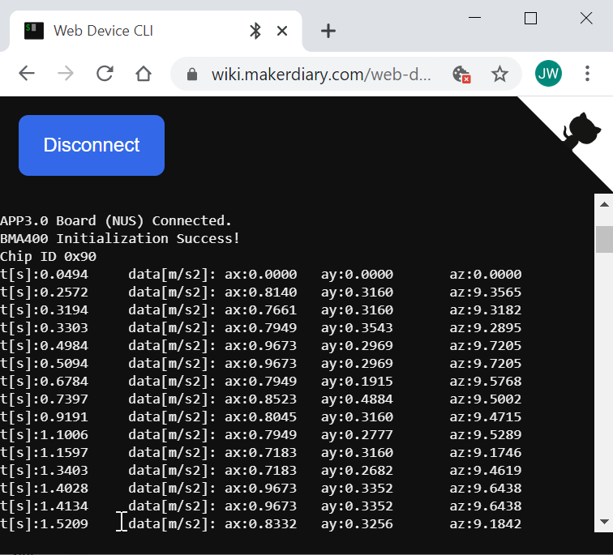
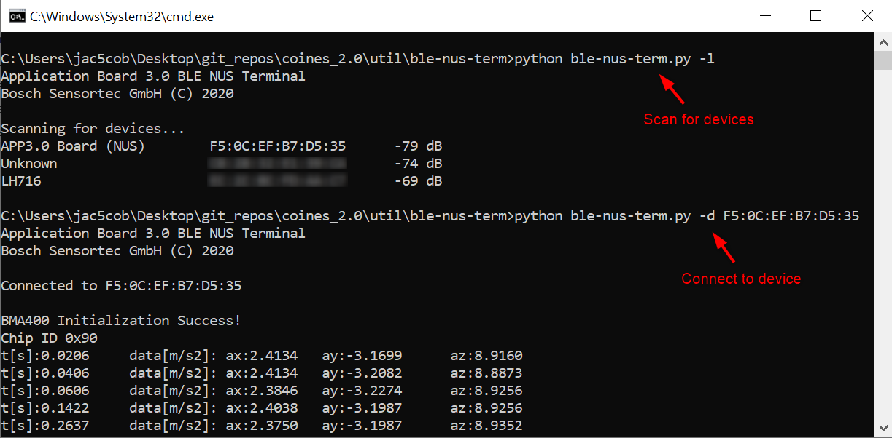
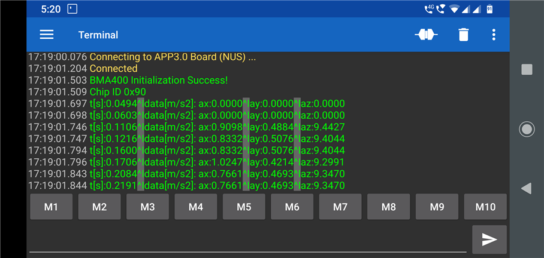

# Sending data over BLE using APP3.0

BLE is simplified now with COINES and NUS (Nordic UART service) ! :smiley: :sunglasses:

The simplest program to send data over BLE is listed below:

```c
#include<stdio.h>
#include"coines.h"

int main()
{
    /* Initialize BLE and USB */
    coines_open_comm_intf(COINES_COMM_INTF_BLE, NULL); // Wait until BLE is connnected

    fprintf(bt_w,"Hello World !\n"); // Write to the file 'bt_w' (BLE-Nordic UART Service)

    coines_close_comm_intf(COINES_COMM_INTF_BLE, NULL);

    return 0;
}
```
---
## Compiling the code

- Go to any of the following examples:
    - `ble_print` (demonstrates the usage of `fprintf` with BLE)
    - `ble_input` (demonstrates the usage of `fscanf` with BLE)
    - `ble_usb_print` (demonstrates how to switch between BLE and USB)
    - `ble_list_file_details` (Print list of files via BLE)

- Compile and download to APP3.0 microcontroller:
   ```
  mingw32-make TARGET=MCU_APP30 download
   ```

## Viewing the output

- If your laptop has Bluetooth 4.0, go to https://wiki.makerdiary.com/web-device-cli/ on a Chrome/Edge/Opera browser (any browser that supports Web Bluetooth).
**Note**: Mozilla Firefox isn't supported.
- Alternatively, the user can also use [ble-nus-term.py](../../../tools/ble-nus-term)
- Connect with the **APP3.0 Board (NUS)**.

- Android users can use [Serial Bluetooth Terminal](https://play.google.com/store/apps/details?id=de.kai_morich.serial_bluetooth_terminal).

**Note**: Any COINES example can be converted touse of BLE by replacing:
-  `printf(` with `fprintf(bt_w,`
-  `COINES_COMM_INTF_USB` with `COINES_COMM_INTF_BLE`

---

## Windows - Google Chrome's Web Bluetooth



## ble-nus-term



## Android - Serial Bluetooth Terminal



---

Cygwin/Linux/Mac users can use `make` instead of `mingw32-make`.