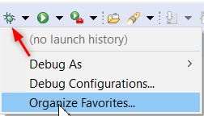
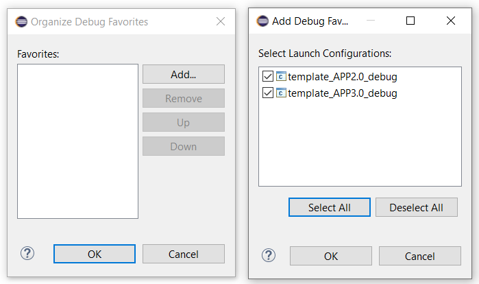
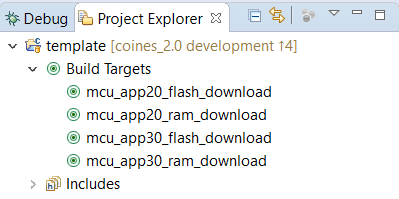
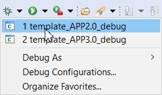

# Using the `template` project in Eclipse
- Download the latest [GNU ARM Eclipse](https://github.com/gnu-mcu-eclipse/org.eclipse.epp.packages/releases).
- Download and install [JLink]() and add it to PATH.
- Import the template project.
  
- Click the **Debug** icon > **Organize favorites**.

- Click **Add** and **Select All** Launch configurations.

- In the **Project Explorer**, click any of the **Build Targets**.

 
- After the successful download, click any of the **Debug configurations**.

